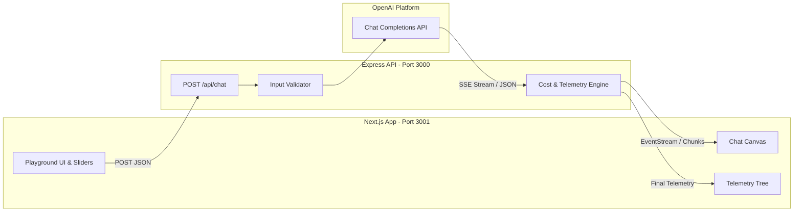

# BOSS 3 — Mini OpenAI LLM Playground

A full-stack, interactive **LLM Playground** built with Node.js, Express, Next.js (App Router), and Tailwind CSS. Designed to explore core concepts of LLM inference, sampling strategies, context window management, real-time token streaming, structured outputs, and request-level observability.

---

## 📸 Key Features

- **Model Selection**: Switch seamlessly between models (`gpt-4o`, `gpt-4o-mini`, `gpt-4-turbo`, `gpt-3.5-turbo`).
- **Sampling Controls**:
  - **Temperature** ($0.0 \rightarrow 2.0$): Tune randomness and distribution sharpness.
  - **Top-p Nucleus Sampling** ($0.0 \rightarrow 1.0$): Dynamically constrain candidate token pools.
  - **Max Tokens** ($64 \rightarrow 4096$): Enforce upper bounds on generation length.
- **Real-Time Streaming**: Low-latency token streaming powered by Server-Sent Events (SSE).
- **System Prompts**: Customizable instructions defining behavior and persona.
- **Structured JSON Mode**: Enforce valid `json_object` outputs via OpenAI's structured output format.
- **Live Token Counting**: Real-time token estimator for inputs, prompt history, and total context usage.
- **Multi-Turn Conversation**: Interactive chat canvas with message copy and clear-history controls.
- **Telemetry & Cost Tracking**: Live calculation of inference latency and request cost based on token pricing matrices.

---

## 📊 Observability Dashboard

Every request captures and renders detailed execution telemetry:

```text
Request
├── input tokens
├── output tokens
├── latency
├── cost
└── model
```

### Telemetry Pricing Matrix

| Model | Input Price (per 1M tokens) | Output Price (per 1M tokens) |
| :--- | :--- | :--- |
| `gpt-4o` | $2.50 | $10.00 |
| `gpt-4o-mini` | $0.15 | $0.60 |
| `gpt-4-turbo` | $10.00 | $30.00 |
| `gpt-3.5-turbo` | $0.50 | $1.50 |

$$\text{Cost} = \frac{(\text{Input Tokens} \times \text{Input Price}) + (\text{Output Tokens} \times \text{Output Price})}{1,000,000}$$

---

## 🏗️ Architecture



---

## 🧠 Concepts Revised

1. **LLM Inference & Logit Sampling**:
   - **Temperature**: Scales the logit distribution before softmax. A temperature of 0 results in greedy argmax decoding; higher temperatures flatten the distribution for creative diversity.
   - **Top-p (Nucleus Sampling)**: Selects the smallest set of tokens whose cumulative probability exceeds threshold $p$, avoiding low-probability tail tokens.
2. **Context Windows**:
   - Multi-turn conversations accumulate tokens across past turns. Both user and assistant turns consume context quota until reaching model limits.
3. **Streaming (Server-Sent Events - SSE)**:
   - Chunked transfer encoding pipes delta tokens as they are generated, drastically decreasing Time to First Token (TTFT).
4. **Structured Outputs**:
   - Constrains decoding to produce syntactically valid JSON matching target schemas.
5. **Observability & Economics**:
   - Tracking latency (ms), prompt tokens, completion tokens, and dollar cost for production visibility.

---

## 📁 Project Structure

```text
llm-playground/
├── src/
│   ├── frontend/                 # Next.js 14 App Router UI
│   │   ├── app/
│   │   │   ├── globals.css       # Tailwind CSS & theme tokens
│   │   │   ├── layout.js        # Root HTML wrapper
│   │   │   └── page.js          # Main playground interface & SSE reader
│   │   ├── next.config.mjs       # Next.js configuration
│   │   ├── tailwind.config.js    # Monochrome styling rules
│   │   └── package.json
│   └── server/
│       └── index.js              # Express backend, validation & SSE endpoint
├── .env                          # Environment variables (API keys)
├── package.json                  # Root scripts & dependencies
└── README.md
```

---

## 🚀 Getting Started

### 1. Prerequisites
- [Node.js](https://nodejs.org/) v18+ (tested on Node v22)
- An active [OpenAI API Key](https://platform.openai.com/)

### 2. Environment Configuration
Create a `.env` file in the project root:
```env
OPENAI_API_KEY=your_openai_api_key_here
PORT=3000
```

### 3. Installation
Install dependencies for both root and frontend:
```bash
# Install backend dependencies
npm install

# Install frontend dependencies
cd src/frontend && npm install && cd ../..
```

### 4. Running the Application

Start the backend and frontend in separate terminals:

**Terminal 1 — Backend (Port 3000):**
```bash
npm run dev
```

**Terminal 2 — Frontend (Port 3001):**
```bash
npm run frontend:dev
```

Open **[http://localhost:3001](http://localhost:3001)** in your browser.

---

## 🔌 API Reference

### `POST /api/chat`

Handles both standard JSON responses and SSE streaming.

#### Request Body
```json
{
  "model": "gpt-4o-mini",
  "messages": [
    { "role": "user", "content": "Explain gravity in one sentence." }
  ],
  "systemPrompt": "You are a physics expert.",
  "temperature": 0.7,
  "topP": 1.0,
  "maxTokens": 500,
  "stream": true,
  "responseFormatJson": false
}
```

#### Response (Non-Streaming: `stream: false`)
```json
{
  "text": "Gravity is the curvature of spacetime caused by mass and energy.",
  "model": "gpt-4o-mini-2024-07-18",
  "usage": {
    "prompt_tokens": 22,
    "completion_tokens": 12,
    "total_tokens": 34
  },
  "latency": 450,
  "cost": 0.000010,
  "telemetry": {
    "model": "gpt-4o-mini",
    "inputTokens": 22,
    "outputTokens": 12,
    "latency": 450,
    "cost": 0.000010
  }
}
```

#### Response (Streaming: `stream: true`)
Server-Sent Events stream:
```text
data: {"type":"chunk","content":"Gravity"}

data: {"type":"chunk","content":" is"}

...

data: {"type":"done","text":"...","telemetry":{"model":"gpt-4o-mini","inputTokens":22,"outputTokens":12,"latency":450,"cost":0.000010}}
```

---

## 📜 License
MIT License. Built for BOSS 3 — AI Cohort.
